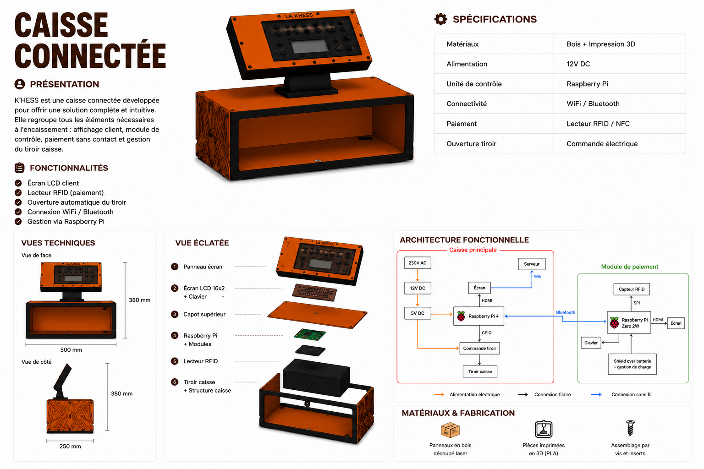

# 2526_Projet1AB_Khess
> [!Note]
> Projet de 1ère année ENSEA sur une caisse enregistreuse pour la K-Fet.

## Sommaire
- [Cahier des charges](#cahier-des-charges)
	- [Caisse enregistreuse portable avec écran tactile](#caisse-enregistreuse-portable-avec-écran-tactile)
	- [Contraintes](#contraintes)
- [Composants](#composants)
- [Choix techniques et justification](#choix-techniques-et-justification)
- [Modèle 3D de la caisse](#mod%C3%A8le-3d-de-la-caisse)
- [Partie Logicielle (Software)](#-partie-logicielle-software)
- [Technologies utilisées](#technologies-utilis%C3%A9es)
- [Avancée du projet](#avanc%C3%A9e-du-projet)
	- [Ce qui a été réalisé](#ce-qui-a-%C3%A9t%C3%A9-r%C3%A9alis%C3%A9)
	- [Ce qui n'a pas (encore) été réalisé](#ce-qui-na-pas-encore-ete-r%C3%A9alis%C3%A9)
 	- [Problèmes rencontrés et solutions trouvées](#probl%C3%A8mes-rencontr%C3%A9s-et-solutions-trouv%C3%A9es)
	- [Améliorations possibles](#am%C3%A9liorations-possibles)
- [Membres du projet](#membres-du-projet)
- [Licence](#licence)

## Cahier des charges
### Caisse enregistreuse portable avec écran tactile
* Interface utilisateur intuitive
* Gestion des produits et des prix
* Paiement avec carte étudiante

### Contraintes
* Portabilité (batterie) : terminal de paiement
* Fiabilité des transactions
* Sécurité des données

## Composants
Voir [Hardware/README.md](Hardware/README.md).

## Choix techniques et justification

## Modèle 3D de la caisse
La caisse automatique est consituée de 3 éléments :
- la caisse entière avec le socle
- le module de paiement
- le support pour la tablette
  
La modélisation 3D de ces différentes pièces à été réaliser avec le logiciel Onshape, voici les liens correspondant : 
* [Caisse entière avec socle](3D/Caisse%20entière%20avec%20socle.stl) 
* [Module paiement final](3D/Module%20payement%20final.stl)
* [Support tablette final](3D/Support%20tablette%20final.stl)

  
## 💻 Partie Logicielle (Software)

Cette section regroupe l'ensemble du code source de l'application web de la caisse connectée, développée avec le framework **Django** (Python).

### 🚀 Accès au Code Source et Déploiement

> ⚠️ **Note sur le dépôt :** Suite à des difficultés techniques lors de la synchronisation et de l'envoi du code sur le dépôt partagé de l'équipe, la version la plus récente et totalement à jour de l'application a été temporairement hébergée sur mon espace personnel.

* 📁 **Code source à jour :** Vous pouvez consulter et récupérer l'intégralité du projet en [cliquant directement sur ce lien vers mon dépôt personnel](https://github.com/zhang-estelle/DatabaseCashRegister).
* 🛠️ **Guide d'installation :** Pour faire fonctionner le code facilement sur votre machine, j'ai rédigé un guide pas-à-pas. Ce tutoriel recense également l'ensemble des blocages et des problèmes techniques que j'ai rencontrés durant le développement ainsi que leurs solutions. [Consulter le tutoriel de configuration Django](https://github.com/DBXYD/2526_Projet1AB_Khess/blob/master/TutoDjango.md).

### 📊 Architecture de la Base de Données

Le système s'appuie sur une base de données relationnelle structurée pour gérer les profils des étudiants, leurs soldes (cotisants ou non), le catalogue de la K-FET et l'historique des ventes.

## Technologies utilisées

- Python
- Django
- Raspberry Pi
- KiCad
- Onshape
- Impression 3D
  
## Avancée du projet
### Ce qui a été réalisé

* prise en main du projet
* création des PCB
* soudure des PCB
* développement du site internet/ interface vendeur avec gestion des stocks, des commandes
* modification 3D de la caisse en changeant les dimensions du socle soutenant la tablette
* modélisation 3D du module de paiement avec plusieurs variantes afin de correspondre à la taille du PCB contenu à l'intérieur
* développement du code du module de payement
* modification 3D de la caisse en changeant le support tablette se mettant sur le socle

### Ce qui n'a pas (encore) été réalisé

* test du PCB
* assemblage de l'ensemble

### Problèmes rencontrés et solutions trouvées

Modélisation 3D:
- La taille du support de tablette était trop petite ( impossibilité de passer les câbles HDMI et USB vers la caisse automatique ). 
On a du imprimer plusieurs fois le support pour trouver la taille adéquate.
- Les trous pour fixer le support de tablette à son support n'étaient pas au bonne endroit après l'impression, on a du percer avec une perceuse les trous pour fixer le support correctement. 
- Problèmes usuels d'impression 3D.

### Améliorations possibles

* revoir le design de la caisse
* améliorer le site internet

## Membres du projet

|  |  |  |  |  |  |  |
| :---: | :---: | :---: | :---: | :---: | :---: | :---: |
| [@Ahhj93](https://github.com/Ahhj93) Bryan-Sowanna Ing | [@NKRIMAT](https://github.com/NKRIMAT) Naïm Krimat | [@Margaux-Lapl](https://github.com/Margaux-Lapl) Margaux Laplante | [@StrangeKobe](https://github.com/StrangeKobe) Rayan Laghouane | [@zhang-estelle](https://github.com/zhang-estelle) Estelle Zhang | [@ClementJ493](https://github.com/ClementJ493) Clément Jouneau | [@rim-05-mma](https://github.com/rim-05-mma) Rim Bouchikhi |
## Licence

Projet académique ENSEA — usage pédagogique.
